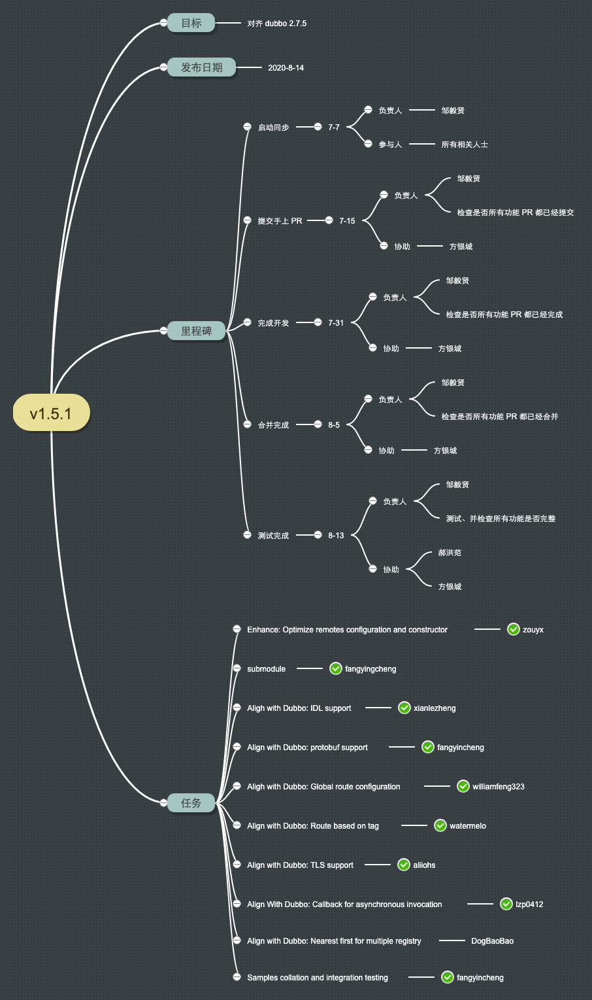

# Project summary

# Develop Plan

# Testing Plan

Finish date: 2020-08-20

## Test branch

[dubbo-go](https://github.com/apache/dubbo-go/): 1.5.1

[dubbo-sample](https://github.com/dubbogo/dubbo-samples/): master

## Test module

* aync: zouyx - done
* configcenter: zouyx - done
* direct: zouyx - done
* filter: fangyincheng - done
* general: fangyingcheng done
    * dubbo - done
    * jsonrpc - done
    * grpc - done
    * rest - done
* generic: fanyincheng - done
* helloworld: fanyincheng - done
* registry - zouyx - done
* multi_registry: fanyincheng - done
* router: zouyx - done
